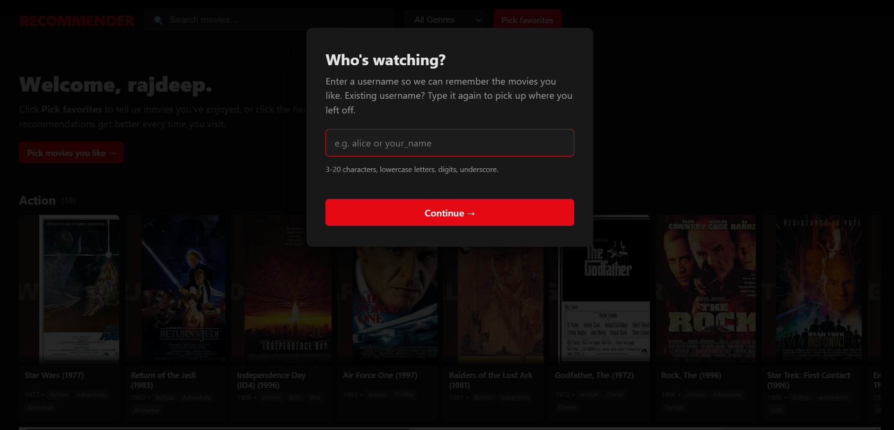
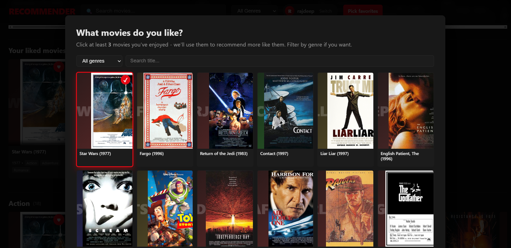
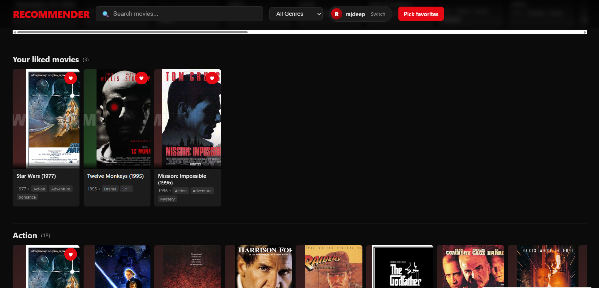

<!--
  Project README. Sections roughly follow the order I'd want a recruiter
  or a future-me to read them in: what is it, why does it exist, what
  does it look like, then how to run / extend it.
-->

# Movie Recsys

> A hybrid movie recommender (SVD++ + gradient-boosted stacker) on the
> MovieLens 100K dataset, served behind a Netflix-style web UI.

[](https://www.python.org/)
[](#10-tests--coverage)
[](#12-contributing--license)

---

## Table of contents

1. [Problem statement & motivation](#1-problem-statement--motivation)
2. [Live demo / screenshots](#2-live-demo--screenshots)
3. [Tech stack](#3-tech-stack)
4. [Features](#4-features)
5. [Architecture](#5-architecture)
6. [Results](#6-results)
7. [Getting started](#7-getting-started)
8. [Environment variables](#8-environment-variables)
9. [API reference](#9-api-reference)
10. [Tests & coverage](#10-tests--coverage)
11. [Roadmap & known issues](#11-roadmap--known-issues)
12. [Contributing & license](#12-contributing--license)

---

## 1. Problem statement & motivation

Recommender systems are everywhere - Netflix, Spotify, Amazon - and the
"give me top-N items for user U" task is a classic ML interview problem.
The two textbook approaches each have a known weakness:

- **Pure collaborative filtering** (matrix factorization, SVD++, etc.)
  learns from user-item interactions only. It nails the
  rating-prediction RMSE but has nothing to say about a brand new user
  or a brand new item - the **cold-start problem**.
- **Pure content-based** ranking uses item metadata (genres, cast,
  popularity) and user demographics, but ignores the rich co-rating
  signal that's actually doing most of the work on a dense dataset.

This project builds a small **hybrid** that does both: SVD++ as the CF
backbone, a gradient-boosted regressor on top of it as the supervised
stacker, and a cold-start path that synthesises a pseudo-user vector
from a handful of "movies I like" picks. Everything is trained on the
public MovieLens 100K dataset (943 users, 1,682 movies, 100,000 ratings)
so anyone can reproduce the numbers in a few minutes on a laptop.

The web UI is there so the model is something you can actually *use*,
not just a number in a notebook.

---

## 2. Live demo / screenshots

There's no public deployment - the dataset is small enough that running
locally takes ~30 seconds end-to-end. After
[Getting started](#7-getting-started), browse to
<http://127.0.0.1:5000>. The flow is three screens:

| 1. Sign in                              | 2. Pick favorites                          | 3. Personalized recs                  |
|-----------------------------------------|--------------------------------------------|---------------------------------------|
|   |    |     |
| The "Who's watching?" modal asks for a username so likes persist across sessions. | Pick 3+ movies you've enjoyed. Filter by genre or search by title. | Your likes pin to the top; the catalog re-ranks below them.            |

---

## 3. Tech stack

| Layer            | What I used                                                  |
|------------------|--------------------------------------------------------------|
| ML / numerics    | `numpy`, `pandas`, `scipy`, `scikit-learn` (`HistGradientBoostingRegressor`) |
| Web backend      | `Flask` 3.x, `requests`                                      |
| Web frontend     | Vanilla HTML/CSS/JS - no framework, no build step           |
| Persistence      | Plain JSON files under `data/profiles/`, `data/posters.json` |
| Posters          | TMDB API (preferred) / Wikipedia API (fallback)              |
| Tests            | `pytest`                                                      |
| Dataset          | [MovieLens 100K](https://grouplens.org/datasets/movielens/100k/) (auto-downloaded on first run) |

Pure Python 3.9+, no GPU, no Docker, no database. The only thing it'll
download is the ~4 MB MovieLens zip and (optionally) some poster JPEGs.

---

## 4. Features

- **Hybrid recommender** = `alpha * SVD++ + (1 - alpha) * GBM` over
  user demographics, genre flags, popularity priors, and the CF
  prediction itself (stacking signal). `alpha` is a CLI flag.
- **Two collaborative backends**: biased matrix factorization
  (`MatrixFactorization`) and SVD++ (`SVDpp`). Pick with `--cf-model`.
- **Vectorized training**: SGD updates use `einsum` + `np.add.at`
  scatter-adds. Avoids the per-rating Python loop.
- **Two ranking-eval protocols**:
  - Full-catalog Precision@K / Recall@K via `argpartition` over the
    dense `(U, I)` score matrix.
  - Sampled-negatives (BPR / NCF-style) Precision@K / Recall@K with
    99 random negatives per user.
- **Reproducible**: deterministic seeds, CLI entrypoints, choice of
  random or per-user temporal split.
- **Cold-start onboarding**: the user picks 3+ movies they like, the
  app averages those items' CF latent factors into a pseudo `p_u`, then
  ranks the catalog. No retraining required.
- **Per-user profiles**: username login, likes persisted to
  `data/profiles/<name>.json`, recs survive a server restart.
- **Poster proxy**: server-side TMDB / Wikipedia lookup with disk cache
  (`data/poster_imgs/`) so the page doesn't re-fetch every reload.
- **Pickle-cached model**: first run trains and caches; subsequent runs
  load in <2 s.

---

## 5. Architecture

High-level flow from raw ratings to a recommendation in the UI:

```
              MovieLens 100K            user demographics + genre flags
              (u.data / u.user / u.item)
                       |                          |
                       v                          v
              ┌──────────────────┐      ┌──────────────────────┐
              │ data.py          │      │ build_user_features  │
              │ - download/load  │      │ build_item_features  │
              │ - id remap       │      └──────────────────────┘
              │ - train/test     │                  |
              └────────┬─────────┘                  |
                       |                            |
                       v                            |
              ┌──────────────────┐                  |
              │ collaborative.py │                  |
              │   MatrixFact.    │                  |
              │       OR         │   ── cf_pred ──┐ |
              │ svdpp.py         │                | |
              │   SVD++          │                v v
              └────────┬─────────┘            ┌────────────────┐
                       |                      │ supervised.py  │
                       |                      │ HistGradient   │
                       |                      │ BoostingReg    │
                       |                      └────────┬───────┘
                       └────── alpha · CF + (1-α)·sup ─┘
                                       |
                                       v
                              ┌────────────────────┐
                              │ hybrid.py          │
                              │ HybridRecommender  │
                              └────────┬───────────┘
                                       |
                       ┌───────────────┼───────────────┐
                       v               v               v
              ┌─────────────┐  ┌──────────────┐ ┌─────────────────┐
              │ train.py    │  │ recommend.py │ │ web_app.py      │
              │ metrics +   │  │ top-N CLI    │ │ Flask + JSON    │
              │ ranking eval│  │              │ │ profiles + UI   │
              └─────────────┘  └──────────────┘ └─────────────────┘
```

**Data path (web UI):** `browser` → `Flask` → cached `HybridRecommender`
(or `cf.Q` directly for cold-start) → `numpy` → JSON → `browser`. Posters
are proxied through `/api/img/<id>` so the browser only ever talks to
our server.

---

## 6. Results

MovieLens 100K, random 80/20 split, seed 42, defaults
(`--factors 80 --epochs 30 --lr 0.005 --reg 0.05 --alpha 0.6`):

| Metric                                       | Hybrid    |
|----------------------------------------------|-----------|
| Train RMSE (SVD++)                           | 0.87      |
| **Test RMSE**                                | **0.91**  |
| Test MAE                                     | 0.71      |
| Relevance accuracy @ 3.5                     | 72%       |
| Precision@10 (full-catalog)                  | ~0.05     |
| Precision@10 (sampled, 99 negatives, r ≥ 4)  | 0.30      |
| Recall@10 (sampled)                          | 0.28      |

Vectorized vs naive ranking-eval loop on a 200-user subsample
(`scripts/benchmark.py`):

| Loop          | Time     |
|---------------|----------|
| Naive Python  | ~11 s    |
| Vectorized    | ~0.02 s  |

**A note on what the numbers mean.** Test RMSE around 0.91 is the
realistic held-out number on a single 80/20 split; the often-quoted
~0.88 SVD++ figure is a *training* RMSE / cross-validation number from
the original Koren paper. The full-catalog Precision@10 looks low
because the candidate set is ~1,500 items - the sampled-negatives
protocol (1 positive + 99 random negatives) is the more flattering one
that papers usually quote.

---

## 7. Getting started

Tested on Python 3.9+ on Windows (PowerShell), but should work the same
on macOS / Linux.

```powershell
# 1. Install deps (a venv is recommended but not required).
pip install -r requirements.txt

# 2. Train + evaluate. The first run downloads MovieLens 100K (~4 MB)
#    to ./data and pickles the trained hybrid model to data/hybrid_model.pkl.
python train.py

# 3. Top-10 recommendations for a few random users.
python recommend.py
python recommend.py --user 42 196 --top 15

# 4. Compare the naive vs vectorized ranking-eval loop.
python benchmark.py

# 5. Web UI. Boots in ~3 s once the model is cached.
python web.py
# -> open http://127.0.0.1:5000
```

### Project layout

```
src/movie_recsys/
  data.py            # MovieLens loader + features + train/test splits
  collaborative.py   # Biased MF with mini-batch SGD
  svdpp.py           # SVD++ with implicit-feedback factors
  supervised.py      # GBM regressor over hand-crafted features
  hybrid.py          # alpha * CF + (1-alpha) * supervised
  metrics.py         # RMSE / MAE / Precision@K / Recall@K
  evaluate.py        # Full-catalog + sampled-negatives eval loops
  recommend.py       # Top-N CLI
  train.py           # Train + eval CLI
  web_app.py         # Flask app
  templates/
    index.html       # Single-page UI (vanilla JS)
scripts/
  benchmark.py       # Naive vs vectorized eval timing
tests/
  test_metrics.py
web.py / train.py / recommend.py / benchmark.py    # thin launchers
```

---

## 8. Environment variables

The app reads exactly one env var. Both are optional - the only thing
you'll lose without them is real movie posters.

| Variable        | Default | What it does                                                                 |
|-----------------|---------|------------------------------------------------------------------------------|
| `TMDB_API_KEY`  | unset   | If set, posters are fetched from [TMDB](https://www.themoviedb.org/settings/api) (higher quality). If unset, the app falls back to Wikipedia, which works without a key. |

```powershell
# Optional - only if you want TMDB posters.
$env:TMDB_API_KEY = "your-key-here"
python web.py
```

Cached posters live in `data/posters.json` (URLs) and
`data/poster_imgs/` (bytes). Delete those if you want to re-fetch.

---

## 9. API reference

### CLI

```powershell
# train.py - the full training + eval pipeline
python train.py `
    --cf-model svdpp `        # or "mf"
    --split random `          # or "time"
    --factors 80 `
    --epochs 30 `
    --lr 0.005 --reg 0.05 `
    --alpha 0.6 `             # CF weight in the hybrid blend
    --k 10 --threshold 3.5 `
    --rank-threshold 4.0 `
    --n-negatives 99

# recommend.py - top-N for one or more users
python recommend.py `
    --user 42 196 `           # 0-indexed user ids
    --top 15 `
    --cf-model svdpp `
    --alpha 0.6 `
    --retrain                 # ignore cached model
```

### HTTP

All endpoints return JSON. `<name>` is a username matching
`^[a-z0-9_]{3,20}$`.

| Method   | Path                              | Description                                                       |
|----------|-----------------------------------|-------------------------------------------------------------------|
| `GET`    | `/`                               | Single-page web UI (HTML).                                        |
| `GET`    | `/api/genres`                     | List of genre names.                                              |
| `GET`    | `/api/movies?q=&genre=&limit=`    | Search the catalog (popularity-sorted).                           |
| `GET`    | `/api/popular?genre=&limit=`      | Popular titles (used by the onboarding picker).                   |
| `POST`   | `/api/cold_recommend`             | Stateless cold-start. Body: `{liked: [int], top, genre}`.         |
| `GET`    | `/api/img/<item_id>`              | Proxied poster bytes (with disk cache).                           |
| `GET`    | `/api/profile/<name>`             | Load a profile, auto-creating it on first hit.                    |
| `PUT`    | `/api/profile/<name>`             | Replace the liked list. Body: `{liked: [int]}`.                   |
| `POST`   | `/api/profile/<name>/like`        | Toggle a single like. Body: `{item_id: int}`.                     |
| `GET`    | `/api/profile/<name>/likes`       | This user's liked movies, with metadata.                          |
| `GET`    | `/api/profile/<name>/recommend?top=&genre=` | Personalized cold-start top-N for this user.            |

#### Quick sanity check

```powershell
$base = "http://127.0.0.1:5000"
Invoke-RestMethod "$base/api/profile/alice"
Invoke-RestMethod -Method Put -Uri "$base/api/profile/alice" `
    -Body (@{ liked = @(63, 99, 49) } | ConvertTo-Json) `
    -ContentType "application/json"
Invoke-RestMethod "$base/api/profile/alice/recommend?top=5"
```

---

## 10. Tests & coverage

```powershell
pytest -q
```

What's covered today:

- `tests/test_metrics.py` - RMSE, MAE, relevance accuracy,
  Precision@K / Recall@K (including the train-mask path).

What's **not** covered (yet) - see [Roadmap](#11-roadmap--known-issues):

- The training loops (MF / SVD++) only have implicit coverage from
  `train.py` running. I trust the convergence numbers as an integration
  check, but there are no unit tests for the gradient math.
- The Flask routes have no tests. Easy to add with Flask's
  `app.test_client()` - just hasn't been a priority.
- No coverage reporter wired in. `pytest-cov` would be a one-liner.

---

## 11. Roadmap & known issues

Things I'd add if I kept working on this:

- **Real held-out evaluation harness.** Right now `train.py` reports
  metrics on a single random split. A proper k-fold loop with mean ±
  std would be more honest.
- **Better cold-start.** Averaging item factors works, but a learned
  cold-start head (e.g. predicting `p_u` from genre preferences) would
  almost certainly do better.
- **Two-tower / neural CF baseline** to compare against the linear
  factor model. The repo's metrics infra is already protocol-compatible.
- **API tests** with `app.test_client()` and a tmpdir-backed
  `PROFILES_DIR`.
- **Auth.** Profiles are keyed by a username with no password. This is
  fine for a local demo, **not** for anything internet-facing.

Known issues:

- Wikipedia poster lookup occasionally returns a wrong image when the
  movie title clashes with a more famous non-film page. The TMDB path
  doesn't have this problem.
- `predict_for_user` and `score_matrix` allocate a dense
  `(|users|, n_items)` array. Fine for ML-100K (943 × 1682), would need
  batching on a bigger dataset.
- The web UI assumes a single Flask process - profile writes aren't
  locked. Concurrent edits to the same `<name>.json` could race. Not a
  concern at demo scale.

---

## 12. Contributing & license

Contributions are welcome - the codebase is small enough to read in an
afternoon. Recommended workflow:

1. Fork and create a feature branch.
2. Add or update a test under `tests/`.
3. Run `pytest -q` locally before opening a PR.
4. Keep the public API of `MatrixFactorization`, `SVDpp`,
   `SupervisedRecommender`, and `HybridRecommender` stable - other
   modules and the web app depend on it.

Released under the **MIT License**. MovieLens 100K is © GroupLens
Research and is governed by their own
[terms of use](https://files.grouplens.org/datasets/movielens/ml-100k-README.txt) -
the data isn't redistributed in this repo, it's downloaded on first run.
